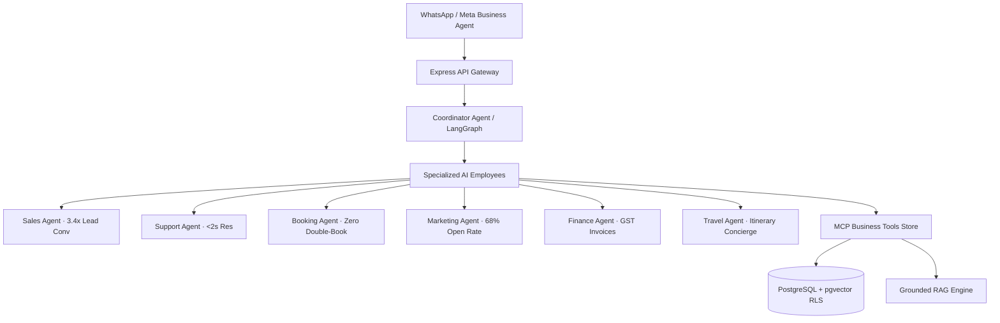

# SaarthiOne — Executive Summary

> **Mission Statement**: *"Run your entire business through AI-powered conversations."*

---

## 1. The Opportunity

Meta is building an AI-native Business Operating System inside WhatsApp, Messenger, and Instagram. Rather than building a basic chatbot builder, **SaarthiOne** is designed as the **"Shopify + Salesforce + Zendesk + HubSpot + AI Employee"** for SMBs.

Instead of hiring separate teams for sales, support, scheduling, marketing, finance, and concierge services, SMBs subscribe to SaarthiOne. The platform deploys specialized **AI Employees** that handle the entire business lifecycle 24/7 directly inside WhatsApp.

### Daily Impact (Live Benchmark)
- **126** customer messages answered automatically
- **8** appointments & reservations confirmed
- **₹74,000** in abandoned sales recovered monthly
- **39** qualified leads nurtured & followed up

---

## 2. Platform Architecture & AI Employee Roster



### The 6 Specialized AI Employees
1. **Sales Agent**: Converts inbound queries into paid customers with instant quotes & direct booking links.
2. **Support Agent**: 24/7 instant resolution (<2s response time) with automatic emergency escalation to human operators.
3. **Booking Agent**: Real-time slot selection & calendar reservation with zero double-bookings.
4. **Marketing Agent**: Consent-safe broadcasts, automatic promo code application, and re-engagement campaigns.
5. **Finance Agent**: Instant Razorpay payment links, official GST tax invoice generation (PDF), and automated refunds.
6. **Travel Agent**: Complete trip planning, flight & hotel concierge, and custom day-by-day itineraries.

---

## 3. Uninterrupted Customer Journey (Discover → Loyalty)

SaarthiOne replaces friction-filled forms and cart checkouts with a single continuous WhatsApp thread:

```
[01 Discover] → [02 Understand] → [03 Recommend] → [04 Choose] → [05 Pay] → [06 Retain]
 Click-to-WA       Qualification      Catalogue RAG    List Picker   Razorpay Link  Follow-up
```

1. **01 Discover**: Aarav taps "Chat on WhatsApp" on an Instagram Ad. Thread opens with consent tracking & context.
2. **02 Understand**: Natural conversational qualification (dates, budget, preferences) logged into CRM.
3. **03 Recommend**: Grounded catalogue retrieval (`search_travel_packages`) returning verified prices & inclusions.
4. **04 Choose**: Interactive in-thread list picker for room/villa selection.
5. **05 Pay**: Razorpay link generated in chat; instant confirmation on signed webhook payment receipt.
6. **06 Retain**: Automated packing lists, review requests, and returning-guest discounts within 09:00-21:00 UTC windows.

---

## 4. Multi-Industry Support

SaarthiOne supports specialized skills and workflows across multiple SMB verticals:
- **Travel & Tourism**: Holiday package quotes, flight/hotel booking & itinerary planning.
- **Restaurant & Dining**: Table reservations, dietary options & digital menu orders.
- **Clinic & Healthcare**: Doctor appointment token allocation & patient reminders.
- **Salon & Wellness**: Stylist slot scheduling & spa service packages.
- **Education & Coaching**: Course inquiry, demo slot booking & fee payment.
- **Retail & E-commerce**: Product catalogue search, order tracking & return assistance.

---

## 5. Key Governance Differentiators

1. **Multi-Agent Orchestration**: Coordinator agent intelligently routes messages to dedicated AI Employees.
2. **Deterministic Safety Gates**: Policy checks enforce zero hallucinations, zero PII leakage, and automatic human escalation.
3. **Multi-Tenant Row-Level Security**: Isolated PostgreSQL tables with Supabase RLS policies per organization.
4. **Traceable & Auditable**: Every AI decision logged to append-only audit trail for full transparency.
