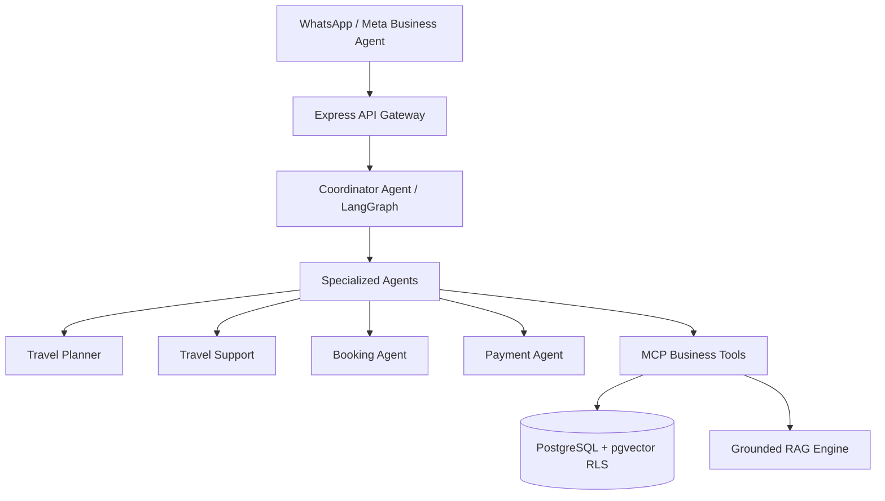

# SaarthiOne — Executive Summary

> **Mission Statement**: *"Run your entire business through AI-powered conversations."*

---

## 1. The Opportunity

Meta is building an AI-native Business Operating System inside WhatsApp, Messenger, and Instagram. Rather than building a basic chatbot builder, **SaarthiOne** is designed as the **"Shopify + Salesforce + Zendesk + HubSpot + AI Employee"** for SMBs.

Instead of hiring:
- Receptionists
- Customer support agents
- Sales representatives
- Booking coordinators
- Campaign managers

SMBs subscribe to SaarthiOne. The AI handles sales, itineraries, bookings, payments, support, and marketing 24/7 on WhatsApp.

---

## 2. Platform Architecture & Industry Skills

---

## 3. Key Differentiators

1. **Multi-Agent Architecture**: Coordinator agent delegates to specialized agents (`travel-planner`, `travel-support`, `booking-agent`).
2. **Deterministic Safety Gates**: Mandatory policy checks enforce zero hallucination, zero medical/unauthorized claim leakage, and automatic human escalation.
3. **Multi-Tenant Row-Level Security**: Every PostgreSQL table is enforced with RLS using Supabase auth policies.
4. **100% Evaluation Compliance**: Built-in regression evaluation suite ensuring zero policy violations.
