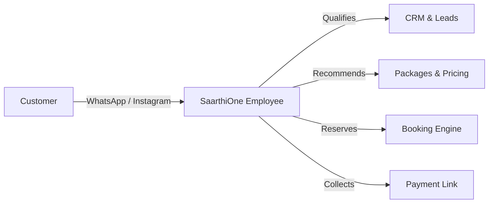

# Product Vision & Strategy

## 1. The Conversational Commerce Paradigm Shift

Traditionally, an SMB required:
1. Custom website development
2. Mobile application
3. Third-party CRM subscription
4. Booking / scheduling software
5. Payment gateway setup
6. Email marketing software

**SaarthiOne** replaces this complex stack with **Conversational Interfaces**. WhatsApp becomes the primary operating UI for both the SMB owner and their customers.

## 2. Platform Vertical Strategy

Travel & Tourism is **Vertical Skill #1**. The core platform remains generic across all industries:

| Core Platform Layer | Industry Skill (Travel) | Future Skill (Salon / Clinic) |
|---------------------|------------------------|-------------------------------|
| Multi-tenant Auth & RBAC | Agency Org & Members | Clinic Org & Doctors |
| LangGraph Coordinator | Travel Planner Agent | Consultation Booking Agent |
| Grounded RAG Search | `travel-packages.md` | `services-menu.md` |
| MCP Business Tools | `search_travel_packages` | `book_appointment_slot` |
| Consent Scheduler | Pre-trip reminders | Post-service follow-up |
