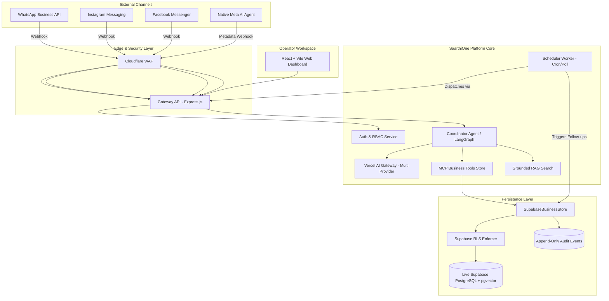

# High-Level Architecture Design (HLD)

```mermaid
flowchart TD
    subgraph Channels["External Channels"]
        WA[WhatsApp Business API]
        IG[Instagram Messaging]
        FB[Facebook Messenger]
        Meta[Native Meta AI Agent]
    end

    subgraph Edge["Edge & Security Layer"]
        CF[Cloudflare WAF]
        GW[Gateway API - Express.js]
    end

    subgraph Core["SaarthiOne Platform Core"]
        Auth[Auth & RBAC Service]
        Coord[Coordinator Agent / LangGraph]
        LLM[Vercel AI Gateway - Multi Provider]
        MCP[MCP Business Tools Store]
        RAG[Grounded RAG Search]
        Cron[Scheduler Worker - Cron/Poll]
    end

    subgraph Data["Persistence Layer"]
        PG[(Live Supabase PostgreSQL + pgvector)]
        RLS[Supabase RLS Enforcer]
        Audit[(Append-Only Audit Events)]
        BusStore[SupabaseBusinessStore]
    end

    subgraph UI["Operator Workspace"]
        Web[React + Vite Web Dashboard]
    end

    WA -->|Webhook| CF --> GW
    IG -->|Webhook| CF --> GW
    FB -->|Webhook| CF --> GW
    Meta -->|Metadata Webhook| CF --> GW

    GW --> Auth
    GW --> Coord
    Coord --> LLM
    Coord --> RAG
    Coord --> MCP
    MCP --> BusStore
    Cron -->|Triggers Follow-ups| BusStore
    Cron -->|Dispatches via| GW
    BusStore --> RLS --> PG
    BusStore --> Audit
    Web --> GW
```
