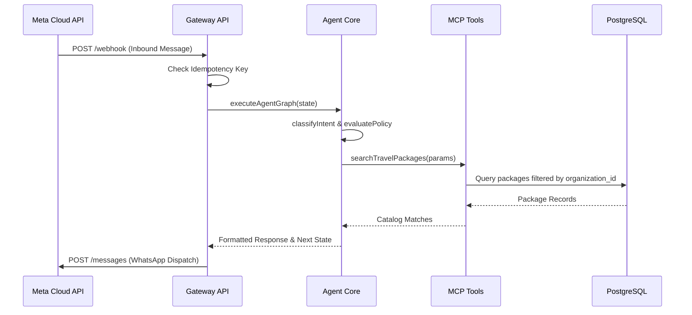

# Low-Level Design (LLD)

## 1. Monorepo Package Boundaries

```
packages/
├── shared-types/        # Zod schemas, logger, constants, custom errors
├── config/              # Environment schema validation (Zod)
├── database/            # Supabase client factory, RLS helper assertions
├── auth/                # Session tokens, OAuth helpers, RBAC permission matrix
├── verticals/           # Vertical skill registry & Travel vertical definition
├── crm/                 # Lead qualification service & Contact deduplication
├── llm-gateway/         # Provider routing, fallback, latency & token cost tracking
├── mcp-business-tools/  # Scoped MCP tool functions & typed Zod schemas
└── agent-core/          # LangGraph state machine, intent router, policy engine, RAG
```

## 2. Inbound Message Processing LLD


