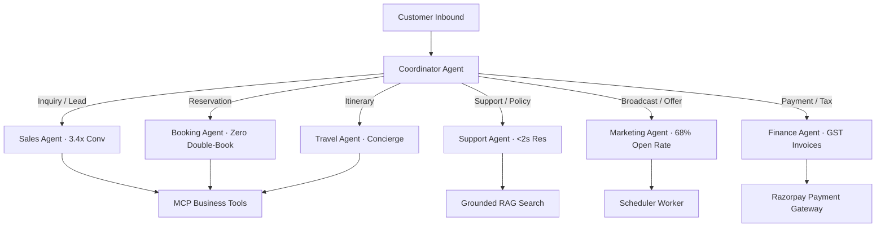

# Agentic AI Architecture Specification

## 1. Multi-Agent Coordinator & Specialist Mesh

## 2. Agent Responsibilities & Benchmark SLA Matrix

| Agent Name | Avatar & SLA Benchmark | Primary Responsibility | Key Tools & Infrastructure |
|------------|------------------------|------------------------|----------------------------|
| **Coordinator Agent** | 🧭 Meta/WhatsApp Ingress | Intent classification, routing & state preservation | Intent Classifier, Vertical Registry |
| **Sales Agent** | 💼 3.4x Lead Conv | Lead qualification, quote generation & instant lock | `upsert_qualified_lead`, `search_travel_packages` |
| **Support Agent** | 🎧 < 2-sec Resolution | 24/7 policy search, visa/refund Q&A & human escalation | `create_human_handoff`, Vector RAG Search |
| **Booking Agent** | 📅 Zero Double-Bookings | Slot selection, reservation lock & appointment tokens | `create_travel_booking`, `getOrderStatus` |
| **Marketing Agent** | 📢 68% WA Open Rate | Re-engagement campaigns, promo codes & consent checks | `request_followup_schedule`, Scheduler Worker |
| **Finance Agent** | 💳 ₹74k Recovered / mo | Payment links, official GST tax invoice PDFs & refunds | `RazorpayPaymentService`, Webhook Listener |
| **Travel Agent** | 🌴 Concierge Plans | Customized day-by-day trip planning & vouchers | `search_travel_packages`, Itinerary Builder |

---

## 3. OpenMontage AI Video & Multi-Modal Media Engine

SaarthiOne integrates the **OpenMontage** pipeline pattern (`calesthio/OpenMontage`) for automated AI video generation, motion clip rendering, and voiceover production:

- **AI Video Providers**: Fal.ai (FLUX / Veo / Kling / MiniMax), Replicate (Seedance / Wan2.1), Kling AI direct API.
- **Stock Media Sourcing**: Pexels, Pixabay, Unsplash, Archive.org.
- **AI Voice & Music**: ElevenLabs, Google Cloud TTS, Suno AI music.
- **Agent Integration**: `generate_promo_media` MCP tool exposed to Marketing & Travel Agents for generating in-thread video teasers and campaign reels.

