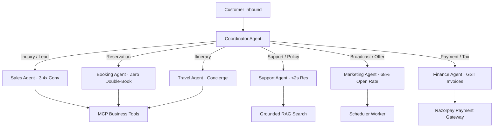

# Agentic AI Architecture Specification

## 1. Multi-Agent Coordinator & Specialist Mesh

## 2. Agent Responsibilities & Benchmark SLA Matrix

| Agent Name | Avatar & SLA Benchmark | Primary Responsibility | Key Tools & Infrastructure |
|------------|------------------------|------------------------|----------------------------|
| **Coordinator Agent** | 🧭 Meta/WhatsApp Ingress | Intent classification, routing & state preservation | Intent Classifier, Vertical Registry |
| **Sales Agent** | 💼 3.4x Lead Conv | Lead qualification, quote generation & instant lock | `upsert_qualified_lead`, `search_travel_packages`, `manage_lead_funnel` |
| **Support Agent** | 🎧 < 2-sec Resolution | 24/7 policy search, visa/refund Q&A & human escalation | `create_human_handoff`, Vector RAG Search, `configure_chat_automation` |
| **Booking Agent** | 📅 Zero Double-Bookings | Slot selection, reservation lock & appointment tokens | `create_travel_booking`, `getOrderStatus` |
| **Marketing Agent** | 📢 68% WA Open Rate | Re-engagement campaigns, promo codes & consent checks | `request_followup_schedule`, `generate_promo_media`, `analyze_local_seo`, `run_seo_audit` |
| **Finance Agent** | 💳 ₹74k Recovered / mo | Payment links, official GST tax invoice PDFs & refunds | `RazorpayPaymentService`, Webhook Listener |
| **Travel Agent** | 🌴 Concierge Plans | Customized day-by-day trip planning & vouchers | `search_travel_packages`, `generate_promo_media` |

---

## 3. OpenMontage AI Video & Multi-Modal Media Engine

SaarthiOne integrates the **OpenMontage** pipeline pattern (`calesthio/OpenMontage`) for automated AI video generation, motion clip rendering, and voiceover production:

- **Multi-Modal Engine Architecture**: Delegated via `createMediaServiceFromEnv()` in `@business-os-ai/integrations` to the `generate_promo_media` MCP tool.
- **Render Status Pipeline**:
  - `unconfigured`: Prompt & specs ready; API keys missing for external providers (`PEXELS_API_KEY`, `SHOTSTACK_API_KEY`).
  - `assets_ready`: Real stock footage and voice narration generated; ready for final MP4 stitching.
  - `rendering`: Shotstack / Remotion cloud render pipeline actively processing.
  - `done`: Final MP4 promo reel or voice narration data URL generated.
- **100% Free / Zero-Cost Default Engine**: Defaults to `$0.00` cost using Archive.org, Pexels free tier, and Piper TTS / offline neural narration.
- **AI Voice & Music**: ElevenLabs, Google Cloud TTS, Piper TTS.
- **Agent Integration**: `generate_promo_media` MCP tool exposed to Marketing & Travel Agents for generating in-thread video teasers, voice notes, and campaign reels.

