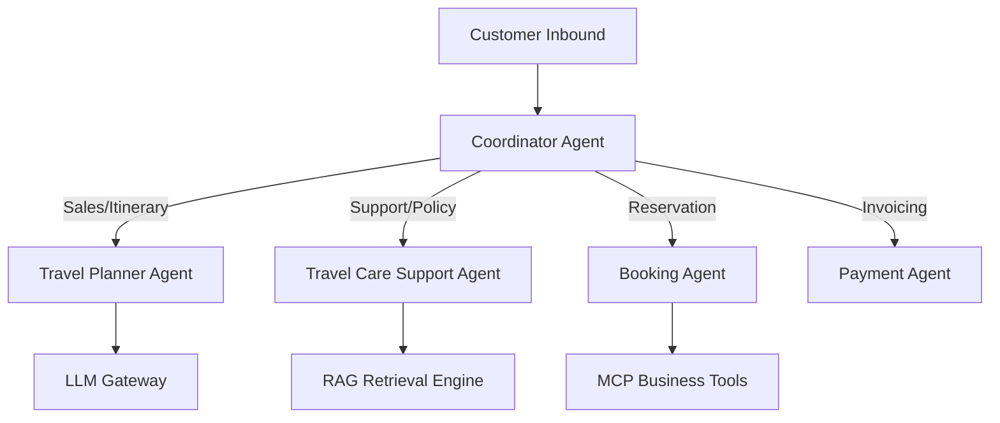

# Agentic AI Architecture Specification

## 1. Multi-Agent Coordinator & Specialist Mesh

## 2. Agent Responsibilities Matrix

| Agent Name | Primary Responsibility | Key Tools Used |
|------------|------------------------|----------------|
| **Coordinator Agent** | Intent routing & delegate selection | Intent Classifier, Vertical Registry |
| **Travel Planner Agent** | Lead qualification & itinerary generation | `search_travel_packages`, `upsert_qualified_lead` |
| **Travel Care Support Agent** | Policy Q&A & escalation | `create_human_handoff`, RAG Search |
| **Booking Agent** | Reservation confirmation & status | `create_travel_booking`, `getOrderStatus` |
| **Payment Agent** | Invoicing & payment link generation | `generate_payment_link`, `process_refund` |
