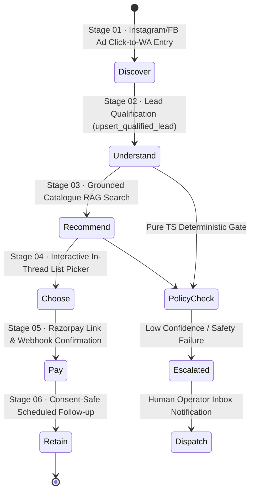

# Conversation Orchestrator Architecture

## 1. LangGraph State Machine & 6-Stage Customer Journey



## 2. State Object Contract (`AgentState`)

```typescript
export interface AgentState {
  organizationId: string;
  contactId: string;
  conversationId: string;
  journeyStage: 'discover' | 'understand' | 'recommend' | 'choose' | 'pay' | 'retain';
  inboundMessage: string;
  recentMessages: Array<{ direction: 'inbound' | 'outbound'; content: string; createdAt: string }>;
  customerContext?: Record<string, unknown>;
  intent: IntentType;
  extractedFields: Record<string, unknown>;
  retrievedSources: Array<{ documentId: string; chunkId: string; content: string; score: number }>;
  toolCallsProposed: Array<{ toolName: string; args: Record<string, unknown> }>;
  policyDecision?: PolicyDecision;
  finalResponseText?: string;
  hasHandoff: boolean;
  errors: string[];
}
```

## 3. Journey Stage Orchestration Policy Matrix

| Journey Stage | Primary Agent | Key In-Thread Interaction | Deterministic Policy Gate |
|---------------|---------------|---------------------------|---------------------------|
| **01 Discover** | Coordinator | Instant greeting, ad source tracking | Opt-in consent check |
| **02 Understand**| Sales Agent | Natural Q&A (dates, budget, travellers) | Lead score thresholds (0-100) |
| **03 Recommend** | Travel / Support | Verified catalogue cards & inclusions | Groundedness score check (>0.85) |
| **04 Choose** | Booking Agent | Interactive in-thread List Picker | Inventory & slot availability lock |
| **05 Pay** | Finance Agent | Razorpay payment card + UPI link | Webhook HMAC signature verification |
| **06 Retain** | Marketing Agent | Packing list, review prompt, 10% discount | 09:00-21:00 UTC legal window check |

