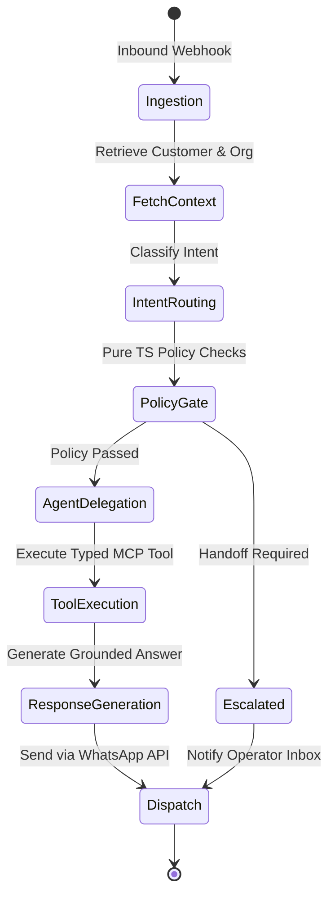

# Conversation Orchestrator Architecture

## 1. LangGraph State Machine Lifecycle



## 2. State Object Contract (`AgentState`)

```typescript
export interface AgentState {
  organizationId: string;
  contactId: string;
  conversationId: string;
  inboundMessage: string;
  recentMessages: Array<{ direction: 'inbound' | 'outbound'; content: string; createdAt: string }>;
  customerContext?: Record<string, unknown>;
  intent: IntentType;
  extractedFields: Record<string, unknown>;
  retrievedSources: Array<{ documentId: string; chunkId: string; content: string; score: number }>;
  toolCallsProposed: Array<{ toolName: string; args: Record<string, unknown> }>;
  policyDecision?: PolicyDecision;
  finalResponseText?: string;
  hasHandoff: boolean;
  errors: string[];
}
```
