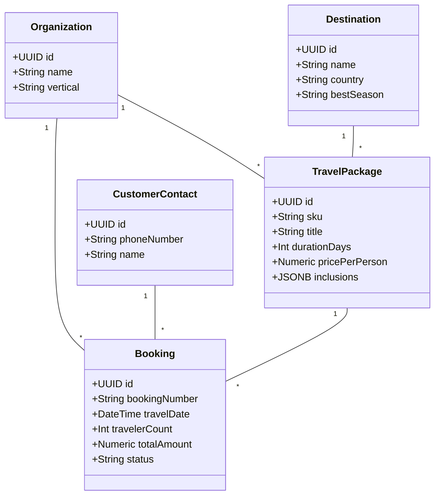

# Travel Domain Model Specification

## 1. Domain Entities & Aggregates

```mermaid
classDiagram
    class Organization {
        +UUID id
        +String name
        +String vertical
    }

    class TravelPackage {
        +UUID id
        +String sku
        +String title
        +Int durationDays
        +Numeric pricePerPerson
        +JSONB inclusions
    }

    class Destination {
        +UUID id
        +String name
        +String country
        +String bestSeason
    }

    class Booking {
        +UUID id
        +String bookingNumber
        +DateTime travelDate
        +Int travelerCount
        +Numeric totalAmount
        +String status
    }

    class CustomerContact {
        +UUID id
        +String phoneNumber
        +String name
    }

    Organization "1" -- "*" TravelPackage
    Organization "1" -- "*" Booking
    Destination "1" -- "*" TravelPackage
    CustomerContact "1" -- "*" Booking
    TravelPackage "1" -- "*" Booking
```
