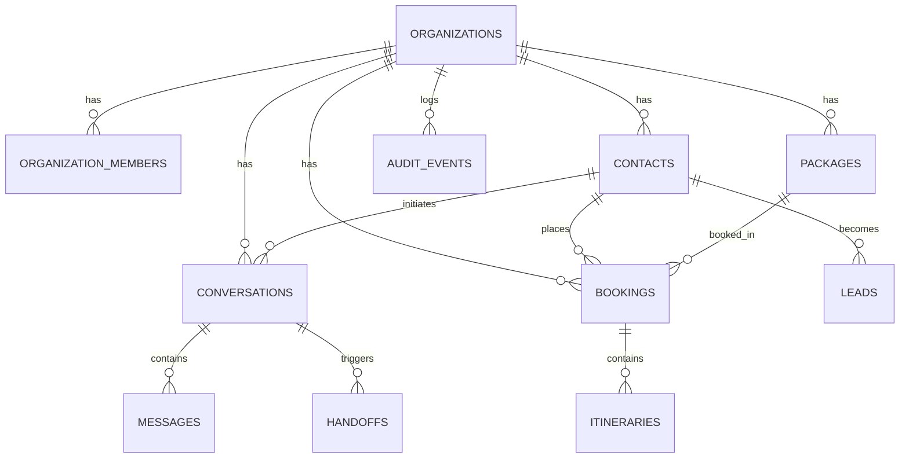

# Entity-Relationship (ER) Diagrams

```mermaid
erDiagram
    ORGANIZATIONS ||--o{ ORGANIZATION_MEMBERS : has
    ORGANIZATIONS ||--o{ CONTACTS : has
    ORGANIZATIONS ||--o{ CONVERSATIONS : has
    ORGANIZATIONS ||--o{ PACKAGES : has
    ORGANIZATIONS ||--o{ BOOKINGS : has
    ORGANIZATIONS ||--o{ AUDIT_EVENTS : logs

    CONTACTS ||--o{ CONVERSATIONS : initiates
    CONTACTS ||--o{ LEADS : becomes
    CONTACTS ||--o{ BOOKINGS : places

    CONVERSATIONS ||--o{ MESSAGES : contains
    CONVERSATIONS ||--o{ HANDOFFS : triggers

    PACKAGES ||--o{ BOOKINGS : booked_in
    BOOKINGS ||--o{ ITINERARIES : contains
```
