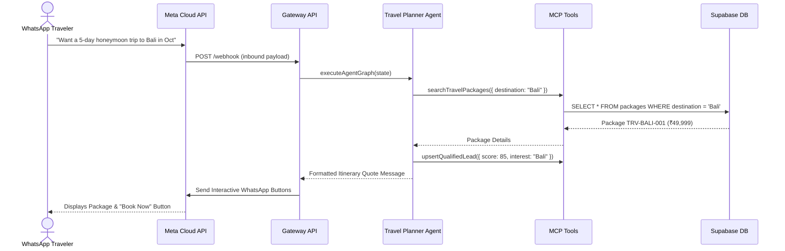

# Sequence Diagrams

## 1. Travel Package Inquiry & Quote Generation

```mermaid
sequenceDiagram
    actor Customer as WhatsApp Traveler
    participant WA as Meta Cloud API
    participant GW as Gateway API
    participant Agent as Travel Planner Agent
    participant MCP as MCP Tools
    participant DB as Supabase DB

    Customer->>WA: "Want a 5-day honeymoon trip to Bali in Oct"
    WA->>GW: POST /webhook (inbound payload)
    GW->>Agent: executeAgentGraph(state)
    Agent->>MCP: searchTravelPackages({ destination: "Bali" })
    MCP->>DB: SELECT * FROM packages WHERE destination = 'Bali'
    DB-->>MCP: Package TRV-BALI-001 (₹49,999)
    MCP-->>Agent: Package Details
    Agent->>MCP: upsertQualifiedLead({ score: 85, interest: "Bali" })
    Agent-->>GW: Formatted Itinerary Quote Message
    GW->>WA: Send Interactive WhatsApp Buttons
    WA-->>Customer: Displays Package & "Book Now" Button
```
