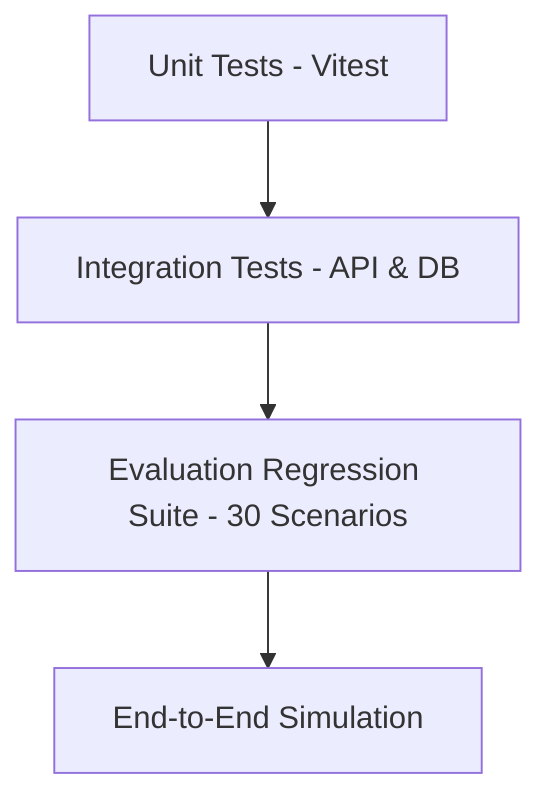

# Testing Strategy & Quality Assurance

## 1. Multi-Layer Test Automation

## 2. Test Execution Commands
- Unit Tests: `pnpm test`
- Integration Tests: `pnpm test:integration`
- Evaluation Suite: `pnpm test:eval`
