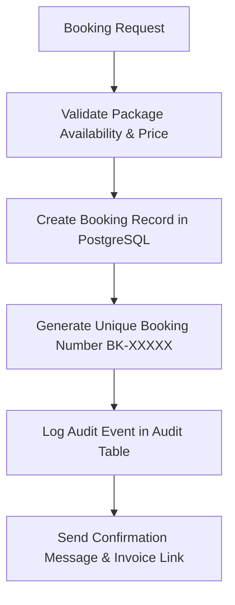

# Booking & Reservation Agent Specification

> **Agent ID**: `booking-agent`  
> **Role**: Unified Reservation Lifecycle & Booking Confirmation Agent  

---

## 1. Overview & Objectives

The **Booking Agent** manages the transactional booking lifecycle for holiday packages:
- Creates unique booking numbers (`BK-12345`)
- Coordinates package, hotel, flight, and tour activity reservations
- Generates PDF vouchers and sends instant WhatsApp confirmations
- Handles booking modifications, date changes, and cancellations.

---

## 2. Agent Workflow Diagram

---

## 3. Tool Permissions & MCP Interfaces

| Tool Name | Scope | Purpose |
|-----------|-------|---------|
| `create_travel_booking` | Tenant-scoped | Create booking record with idempotency key |
| `getOrderStatus` | Tenant-scoped | Retrieve status of booking by booking number |
