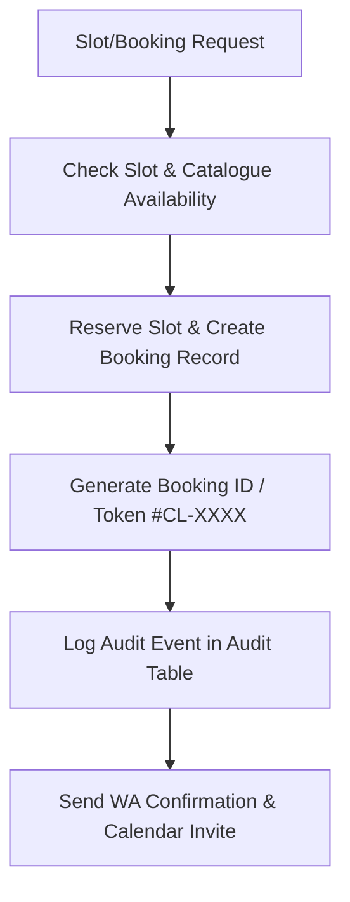

# Booking & Reservation Agent Specification

> **Agent ID**: `booking-agent`  
> **Avatar**: 📅 Booking Agent  
> **SLA Benchmark**: Zero Double-Bookings Guarantee  
> **Role**: Slot Selection, Token Allocation & Real-time Reservation Agent  

---

## 1. Overview & Objectives

The **Booking Agent** manages the transactional reservation lifecycle for SMBs across Travel, Dining, Clinics, and Wellness:
- Creates unique booking numbers (`BK-9921`) and appointment tokens (`#CL-8842`)
- Coordinates real-time slot selection with zero double-booking guarantee
- Dispatches instant WhatsApp calendar invites & confirmation vouchers
- Handles appointment rescheduling, date modifications, and cancellations

---

## 2. Agent Workflow Diagram

---

## 3. Sample Live Dialogue (https://saarthione.vercel.app/)

> **Customer**: *"Do you have slots for Doctor Appointment tomorrow at 4 PM?"*  
> **Booking Agent**: *"Dr. Sharma has a slot open tomorrow at 4:30 PM. Shall I confirm your consultation?"*  
> **Customer**: *"Yes, confirm 4:30 PM please."*  
> **Booking Agent**: *"✅ Appointment Confirmed! Appointment ID: #CL-8842. Calendar invite sent to your WhatsApp."*

---

## 4. Tool Permissions & MCP Interfaces

| Tool Name | Scope | Purpose |
|-----------|-------|---------|
| `create_travel_booking` | Tenant-scoped | Create booking record with idempotency key |
| `getOrderStatus` | Tenant-scoped | Retrieve status of booking by booking number |

