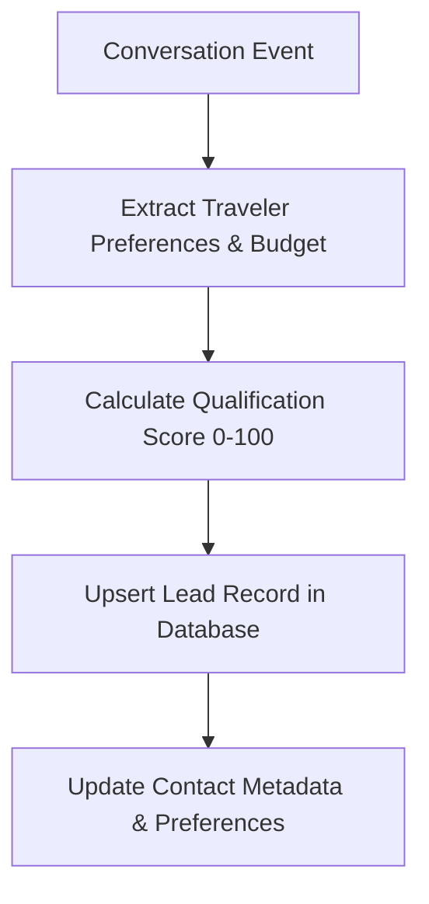

# CRM & Customer Memory Agent Specification

> **Agent ID**: `crm-agent`  
> **Role**: Lead Scoring, Profile Enrichment & Customer Memory Agent  

---

## 1. Overview & Objectives

The **CRM Agent** continuously maintains customer records:
- Scores travel leads based on budget, travel dates, group size, and buying intent (0-100 score)
- Updates pipeline stages (`new` → `contacted` → `qualified` → `proposal` → `won`)
- Stores travel preferences (preferred seat, dietary requirements, hotel star rating, airline choice)
- Merges duplicate contact profiles across WhatsApp and Instagram channels.

---

## 2. Agent Workflow Diagram

---

## 3. Tool Permissions & MCP Interfaces

| Tool Name | Scope | Purpose |
|-----------|-------|---------|
| `upsert_qualified_lead` | Tenant-scoped | Update lead score and interest area |
| `get_customer_context` | Tenant-scoped | Fetch full contact history and preferences |
