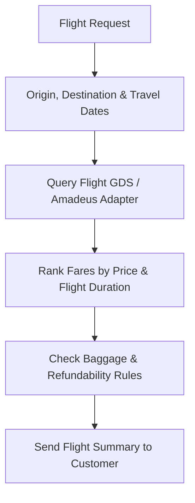

# Flight & Transport Agent Specification

> **Agent ID**: `flight-agent`  
> **Role**: Flight Search, Fare Class Selection & Baggage Specialist  

---

## 1. Overview & Objectives

The **Flight Agent** handles air travel logistics for individual and group travel bookings:
- Direct vs connecting flight comparison (IndiGo, Singapore Airlines, Emirates, Air India)
- Baggage policy explanation (15kg economy vs 30kg flex fare)
- Seat selection (window, aisle, extra legroom)
- Flight fare holds and ticket issuance notifications.

---

## 2. Agent Workflow Diagram

---

## 3. Tool Permissions & MCP Interfaces

| Tool Name | Scope | Purpose |
|-----------|-------|---------|
| `search_flights` | External API / Database | Query available flights and fare classes |
| `hold_flight_fare` | GDS Adapter | Hold flight ticket fare before payment confirmation |
