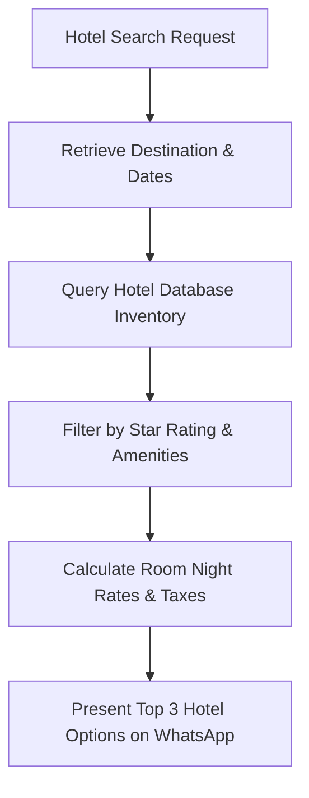

# Hotel & Accommodation Agent Specification

> **Agent ID**: `hotel-agent`  
> **Role**: Hotel Search, Room Selection & Amenity Specialist  

---

## 1. Overview & Objectives

The **Hotel Agent** specializes in finding, comparing, and reserving hotel accommodations based on traveler preferences:
- Star rating preferences (3-star, 4-star, 5-star luxury villas)
- Location proximity (beachfront, city center, airport adjacent)
- Specific room amenities (private pool, ocean view, breakfast included, extra beds)
- Room availability checks and real-time inventory locking.

---

## 2. Agent Workflow Diagram

---

## 3. Tool Permissions & MCP Interfaces

| Tool Name | Scope | Purpose |
|-----------|-------|---------|
| `search_hotels` | Tenant-scoped | Search hotel database by destination, rating, and rate |
| `check_room_availability` | Real-time | Verify room inventory for requested travel dates |
| `hold_hotel_room` | Idempotent | Hold room for 30 minutes during payment checkout |
