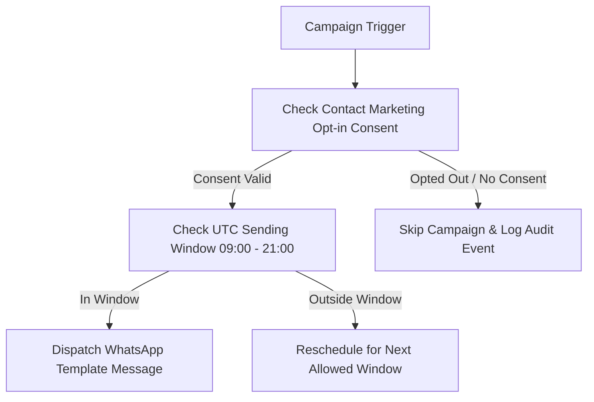

# Marketing & Re-engagement Agent Specification

> **Agent ID**: `marketing-agent`  
> **Role**: Broadcast Campaigns & Re-engagement Automation Agent  

---

## 1. Overview & Objectives

The **Marketing Agent** drives customer retention and campaign automation:
- Dispatches Meta-approved WhatsApp template broadcasts (`qualified_lead_24h_followup`, `appointment_reminder`)
- Verifies explicit marketing opt-in consent before sending
- Respects legal sending windows (09:00 - 21:00 UTC)
- Nurtures cold leads with seasonal holiday package offers.

---

## 2. Agent Workflow Diagram

---

## 3. Tool Permissions & MCP Interfaces

| Tool Name | Scope | Purpose |
|-----------|-------|---------|
| `request_followup_schedule` | Consent-checked | Queue campaign run in scheduler worker |
