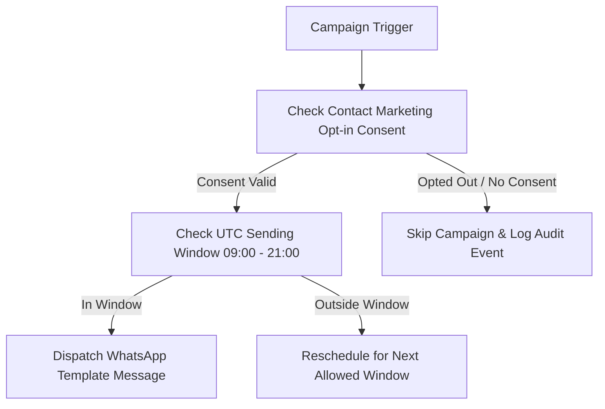

# Marketing & Re-engagement Agent Specification

> **Agent ID**: `marketing-agent`  
> **Avatar**: 📢 Marketing Agent  
> **SLA Benchmark**: 68% WhatsApp Open Rate  
> **Role**: Consent-Safe Broadcast Campaigns & Re-engagement Automation Agent  

---

## 1. Overview & Objectives

The **Marketing Agent** drives customer retention and campaign automation:
- Dispatches Meta-approved WhatsApp template broadcasts (`qualified_lead_24h_followup`, `seasonal_offer`)
- Achieves 68% WhatsApp open rate vs <15% traditional email open rates
- Verifies explicit marketing opt-in consent before every dispatch (`request_followup_schedule`)
- Enforces strict legal sending windows (09:00 - 21:00 UTC)
- Automatically applies promo codes (e.g. `DIVALI15`) and re-engages abandoned inquiries

---

## 2. Agent Workflow Diagram

---

## 3. Sample Live Dialogue (https://saarthione.vercel.app/)

> **Marketing Agent**: *"Hi Priya! 👋 You inquired about the Bali Package last week. We have 2 villa slots left for Diwali week at 15% off!"*  
> **Customer**: *"Is the 15% discount still valid?"*  
> **Marketing Agent**: *"Yes! Discount code DIVALI15 applied automatically. Valid for the next 2 hours."*

---

## 4. Tool Permissions & MCP Interfaces

| Tool Name | Scope | Purpose |
|-----------|-------|---------|
| `request_followup_schedule` | Consent-checked | Queue campaign run in scheduler worker |

