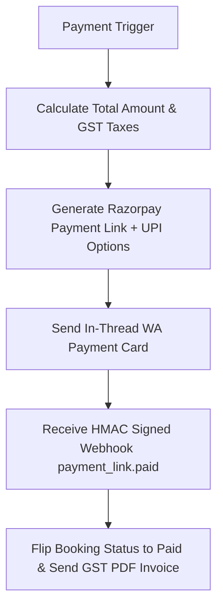

# Finance & Payment Agent Specification

> **Agent ID**: `payment-agent` (or `finance-agent`)  
> **Avatar**: 💳 Finance Agent  
> **SLA Benchmark**: ₹74,000 Recovered Abandoned Sales / Month  
> **Role**: Payment Link Generation, GST Tax Invoicing & Refund Processing Agent  

---

## 1. Overview & Objectives

The **Finance Agent** handles all financial transactions for SaarthiOne SMBs:
- Recovers an average of ₹74,000 in abandoned sales monthly via instant UPI/card links
- Generates secure Razorpay payment URLs directly inside the WhatsApp thread
- Generates official GST tax invoices (PDF) and dispatches receipts
- Verifies payment webhooks idempotently with HMAC signatures (`payment_link.paid`)
- Handles partial payments, advance deposits, and policy-compliant refunds

---

## 2. Agent Workflow Diagram

---

## 3. Sample Live Dialogue (https://saarthione.vercel.app/)

> **Customer**: *"Please send GST invoice for my booking #BK-9921."*  
> **Finance Agent**: *"Here is your official GST Tax Invoice #INV-2026-9921 (PDF). Amount Paid: ₹99,998."*

---

## 4. Tool Permissions & MCP Interfaces

| Tool Name | Scope | Purpose |
|-----------|-------|---------|
| `generate_payment_link` | Gateway Integration | Generate 15-minute secure Razorpay payment URL |
| `process_refund` | Payment Gateway | Initiate partial/full refund based on terms |

