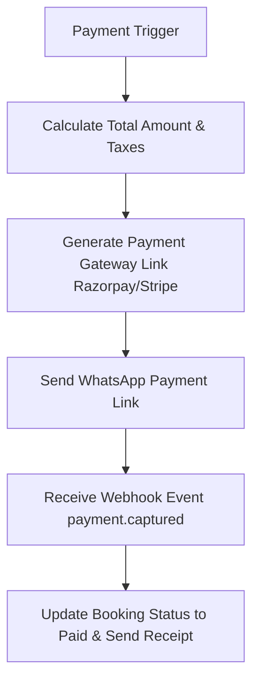

# Payment & Invoicing Agent Specification

> **Agent ID**: `payment-agent`  
> **Role**: Payment Link Generation, Invoicing & Refund Processing Agent  

---

## 1. Overview & Objectives

The **Payment Agent** handles financial transactions for the BusinessOS AI Travel Vertical:
- Generates secure Razorpay / Stripe / UPI payment links
- Sends invoice receipts via WhatsApp
- Verifies payment webhook signatures idempotently
- Processes partial payments (advance deposit vs balance on arrival)
- Handles cancellation refund calculations based on cancellation policies.

---

## 2. Agent Workflow Diagram

---

## 3. Tool Permissions & MCP Interfaces

| Tool Name | Scope | Purpose |
|-----------|-------|---------|
| `generate_payment_link` | Gateway Integration | Generate 15-minute secure payment URL |
| `process_refund` | Payment Gateway | Initiate partial/full refund based on terms |
