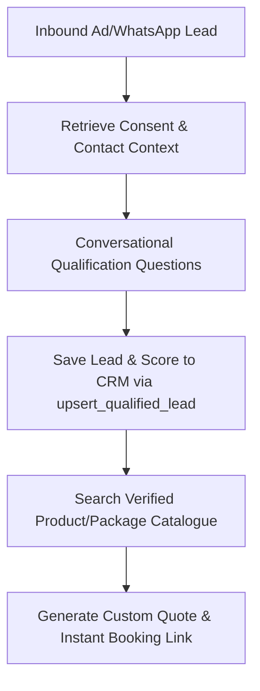

# Sales Agent Specification

> **Agent ID**: `sales-agent`  
> **Avatar**: 💼 Sales Agent  
> **SLA Benchmark**: 3.4x Higher Lead Conversion  
> **Role**: Inbound Inquiry Conversion & Custom Quote Generation Agent  

---

## 1. Overview & Objectives

The **Sales Agent** is the core revenue engine of SaarthiOne. It interacts with inbound leads coming from Instagram/Facebook Click-to-WhatsApp ads or organic messages to:
- Instantly engage leads without friction or forms
- Qualify buyer intent (dates, budget, preferences) via conversational questions
- Log qualified leads into the CRM using `upsert_qualified_lead`
- Generate verified quotes and instant payment links to lock in sales

---

## 2. Agent Workflow Diagram

---

## 3. Sample Live Dialogue (https://saarthione.vercel.app/)

> **Customer**: *"Hi, I want details about your Bali Honeymoon Package."*  
> **Sales Agent**: *"Hello! 👋 Our Bali Honeymoon Package (5N/6D, ₹49,999/person) includes a 4-Star Private Pool Villa in Seminyak, Nusa Penida tour, and candlelight dinner! Would you like me to reserve dates or send the itinerary?"*  
> **Customer**: *"Yes! Send me the itinerary for October 15."*  
> **Sales Agent**: *"Done! 📄 I have locked ₹49,999/person for Oct 15-20. Here is your instant booking link: pay.saarthione.ai/bk-9921"*

---

## 4. Tool Permissions & MCP Interfaces

| Tool Name | Scope | Purpose |
|-----------|-------|---------|
| `upsert_qualified_lead` | Tenant-scoped | Update lead stage, score, budget, and timeline in CRM |
| `search_travel_packages` | Tenant-scoped | Search holiday packages by destination & budget |
| `searchProductCatalog` | Tenant-scoped | Search general product catalog for e-commerce/retail |
| `get_customer_context` | Tenant-scoped | Retrieve past conversation history & customer info |
