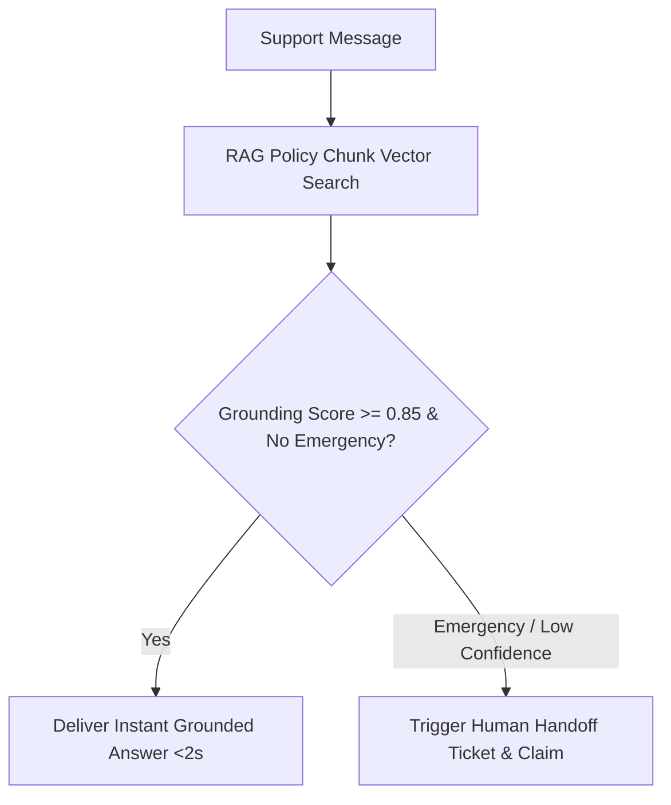

# Support & Escalation Agent Specification

> **Agent ID**: `support-agent` (or `travel-support`)  
> **Avatar**: 🎧 Support Agent  
> **SLA Benchmark**: < 2-Sec Instant Resolution Time  
> **Role**: 24/7 Policy Search, FAQ Q&A & Emergency Human Handoff Agent  

---

## 1. Overview & Objectives

The **Support Agent** manages customer service and post-booking assistance 24/7:
- Answers policy questions using vector RAG (`visa-and-cancellation-policy.md`, `faq.md`)
- Delivers instant resolution in under 2 seconds for routine inquiries
- Detects emergency signals (flight cancellations, stranded travellers, urgent issues)
- Executes deterministic human handoff (`create_human_handoff`) to the Operator Inbox
- Enforces strict safety gates against ungrounded claims or unauthorized modifications

---

## 2. Agent Workflow Diagram

---

## 3. Sample Live Dialogue (https://saarthione.vercel.app/)

> **Customer**: *"What is the visa policy and cancellation refund for Europe tour?"*  
> **Support Agent**: *"Schengen Visa requires application 45 days prior. Cancellations made 30+ days before departure receive a 90% refund! Would you like our visa concierge to assist with slot booking?"*  
> **Customer**: *"My flight got cancelled due to weather!"*  
> **Support Agent**: *"🚨 Emergency detected. I am connecting you to senior agent Aarav right now with your booking history. Hang tight!"*

---

## 4. Tool Permissions & MCP Interfaces

| Tool Name | Scope | Purpose |
|-----------|-------|---------|
| `create_human_handoff` | Tenant-scoped | Escalate conversation to human operator inbox |
| `get_customer_context` | Tenant-scoped | Fetch customer context, recent chat history & active bookings |

