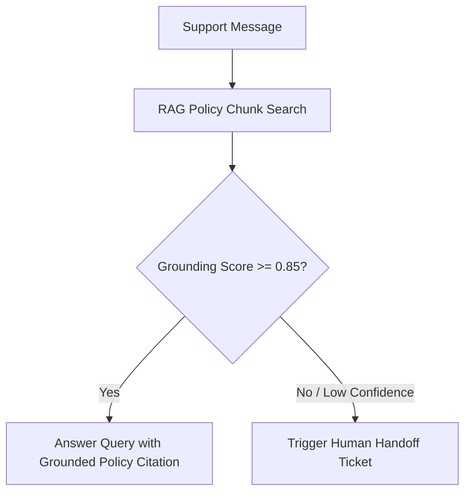

# Support & Escalation Agent Specification

> **Agent ID**: `travel-support`  
> **Role**: Customer Care, RAG Policy Lookup & Human Handoff Agent  

---

## 1. Overview & Objectives

The **Support Agent** manages customer service and post-booking assistance:
- Answers policy questions using RAG (`visa-and-cancellation-policy.md`, `destinations.md`)
- Detects emergency signals (flight cancellation, stranded traveler, medical issue)
- Triggers deterministic human handoff to operator inbox
- Enforces strict safety gates against medical advice or unauthorized modifications.

---

## 2. Agent Workflow Diagram

---

## 3. Tool Permissions & MCP Interfaces

| Tool Name | Scope | Purpose |
|-----------|-------|---------|
| `create_human_handoff` | Organization-scoped | Escalate conversation to human operator inbox |
| `get_customer_context` | Organization-scoped | Fetch customer travel history & active bookings |
