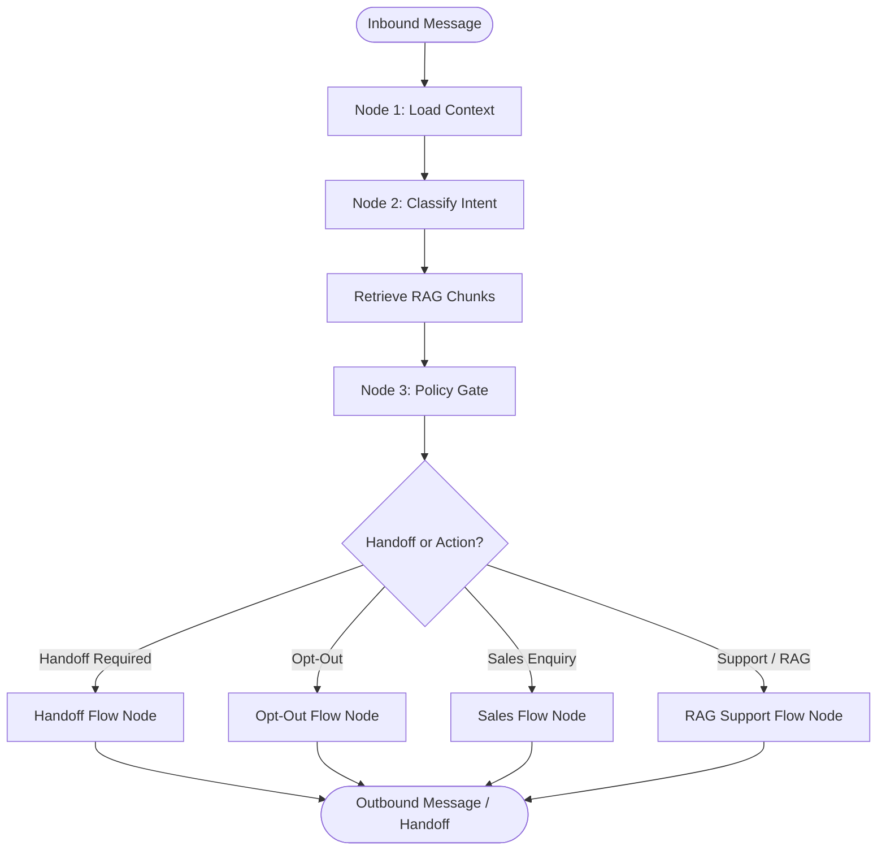

# LangGraph Routing Specification

The agent workspace operates as an async, state-driven workflow graph modelled on LangGraph architecture. State transitions are deterministic, ensuring that no message flows to the client without passing safety checks.

---

## 1. Graph State Model

The graph maintains a mutable state context (`AgentState`) passed between execution nodes:

```typescript
export interface AgentState {
  organizationId: string;
  contactId: string;
  conversationId: string;
  inboundMessage: string;
  traceId: string;

  // Extracted/loaded state
  customerName?: string;
  consentStatus?: 'opt_in' | 'opt_out' | 'none';
  intent: IntentType;
  retrievedSources: Array<{ documentId: string; chunkId: string; content: string; score: number }>;

  // Policy & Decisions
  policyDecision?: PolicyDecision;
  proposedResponse?: string;

  // Execution Metrics
  toolCalls: Array<{ tool: string; input: Record<string, unknown>; output: Record<string, unknown> }>;
  errors: string[];
}
```

---

## 2. Graph Nodes & Execution Pipeline



### Execution Node Details:

1. **Load Context (`nodeLoadContext`)**:
   - Queries database/CRM details for the incoming phone number.
   - Extracts customer name, past message log context, and marketing opt-in consent state.
2. **Classify Intent (`nodeClassifyIntent`)**:
   - Routes messages based on keyword mapping:
     - Opt-out requests (`opt_out`)
     - Script injections/payload hacks (`unsafe_request`)
     - Skincare purchases (`sales_enquiry`)
     - Skincare FAQs (`support_question` / `product_question`)
     - Refund complaints (`complaint_or_refund`)
     - Direct human operator request (`human_request`)
     - Order status / tracking enquiries (`order_status`)
     - Skincare appointment schedules (`booking_request`)
3. **Retrieve RAG Sources**:
   - If the intent is a support or product question, executes semantic vector retrieval against the organization's knowledge base.
4. **Policy Gate (`nodePolicyGate`)**:
   - Executes validation algorithms verifying that the message does not violate safety policies before entering domain flow handlers.
5. **Flow Nodes**:
   - **Handoff Flow**: Runs `create_human_handoff` tool, flags ticket status, and drafts transfer response.
   - **Opt-out Flow**: Revokes consent status in the database and shuts down future campaigns.
   - **Sales Flow**: Runs `search_product_catalog` to matching items, updates CRM lead scores, and qualifies leads if score >= 50.
   - **RAG Support Flow**: Validates retrieval grounding score (>= 0.01 threshold) and templates answers based strictly on retrieved chunks.

---

## 3. Dynamic Flow Routing & Safety

If any step in the workflow graph fails or encounters an unhandled exception, the graph catches the error, appends it to the `errors` log list, and routes the ticket to `create_human_handoff` immediately to prevent deadlocks or silent failures.
