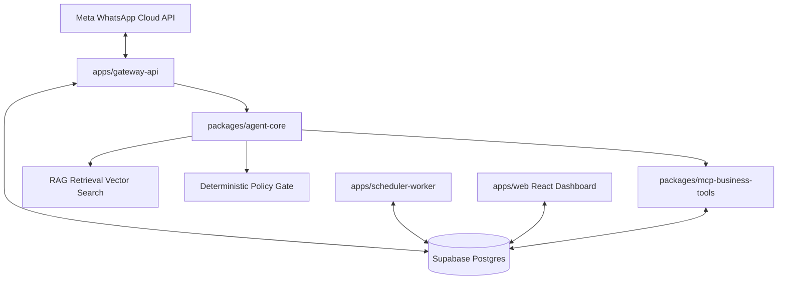
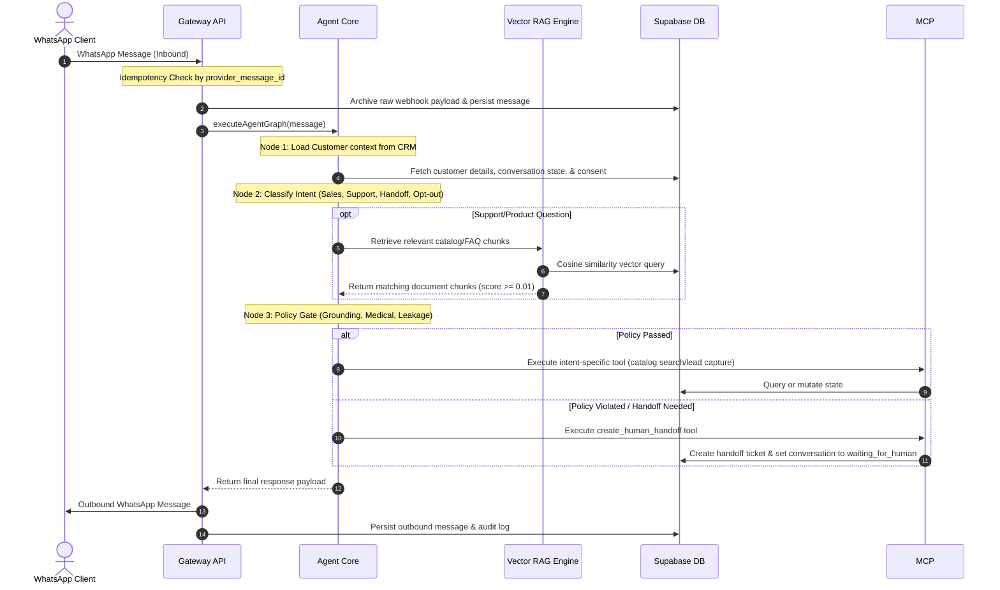

# System Architecture: WhatsApp AI SMB Platform

This document describes the architectural layout, service boundaries, data flow pipelines, and security layers of the WhatsApp AI SMB Platform. It has been built with strict tenant isolation, safety checks, and deterministic policy gates to ensure compliance, security, and auditability.

---

## 1. Overview & Service Boundaries

The platform is organized as a `pnpm` monorepo containing distinct services, packages, and clients.



### Key Architectural Components:
1. **Gateway API (`apps/gateway-api`)**: An Express-based service serving as the WhatsApp Cloud API webhook receiver. It manages verification challenges, inbound messaging queues, raw event archiving, and outbound message deduplication.
2. **Agent Service & Core (`packages/agent-core`)**: The brains of the agent. Implements the message processing state-graph (modeled on LangGraph) consisting of intent classification, deterministic safety checking, RAG chunk retrieval, and tool execution.
3. **MCP Business Tools (`packages/mcp-business-tools`)**: Provides standard, typed, and schema-validated Model Context Protocol (MCP) tools for interacting with CRM contexts, customer records, catalogs, human handoffs, and follow-up schedules.
4. **Scheduler Worker (`apps/scheduler-worker`)**: A background service that checks for scheduled 24-hour lead follow-ups. It enforces UTC sending windows (09:00 - 21:00 UTC) and customer marketing opt-ins.
5. **Operator Dashboard (`apps/web`)**: A premium React dashboard for small-business operators to claim handoffs, search the catalog, schedule campaigns, and monitor compliance metrics.

---

## 2. Data Flow Architecture

The message processing pipeline is fully structured to guarantee auditability and security:



---

## 3. Database Schema & RLS Policies

The database is built on Supabase PostgreSQL. Tenant isolation is enforced natively at the database layer via **Row Level Security (RLS)**.

### Tenant Isolation Architecture:
- Every table contains an `organization_id` column.
- Supabase auth roles or API requests operate under a tenant-scoped session context where `auth.uid()` or the tenant token identifies the client organization.
- RLS policies restrict all `SELECT`, `INSERT`, `UPDATE`, and `DELETE` actions to match the active session `organization_id`. For example:
  ```sql
  CREATE POLICY tenant_isolation_policy ON conversations
    FOR ALL
    USING (organization_id = auth.jwt() ->> 'org_id');
  ```
- Any access violation throws a `TenantAccessError` and prevents data exfiltration.

---

## 4. Grounded RAG & Mock Vector Math

To support retrieval-augmented generation (RAG) for FAQ and product questions, the platform implements a local semantic search engine:

1. **Markdown Document Parsing**:
   - Skincare content files (`products.md`, `shipping-policy.md`, etc.) are chunked by paragraphs and headers.
2. **Word-Hash Vector Model (`MockEmbeddingProvider`)**:
   - In the absence of heavy, paid API model calls, text is parsed into alphanumeric words.
   - A deterministic hashing function accumulates weights across a 1536-dimensional vector:
     $$\text{hash} = \left( \sum (w_i \times 31) \right) \pmod{1536}$$
   - These vectors are normalized to unit length so that cosine similarity values range reliably.
3. **Similarity Query**:
   - The query string is embedded.
   - Cosine similarity is computed against ingested chunks for the specific `organization_id`:
     $$\text{similarity} = \frac{\vec{A} \cdot \vec{B}}{\|\vec{A}\| \|\vec{B}\|}$$
   - Chunks meeting the confidence threshold of `0.01` are returned as grounding evidence. If no sources meet this threshold, the policy engine triggers `insufficient_grounding` and routes the conversation to a human operator.
